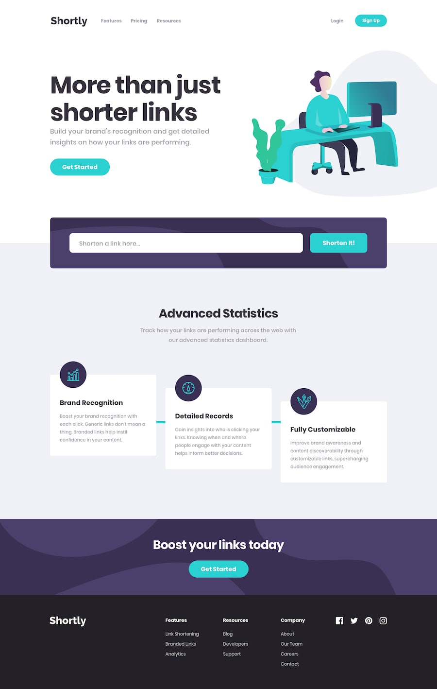

<h1 align="center">Frontend Mentor Challenge | URL shortening API</h1>

<strong>SASS / Vanilla JavaScript</strong>

Your challenge is to integrate with the [shrtcode API](https://app.shrtco.de/) to create shortened URLs and display them like in the designs.

You can use any JavaScript framework/library on the front-end such as React or Vue. You also have complete control over which packages you use to do things like make HTTP requests or style your project.

Your users should be able to:

View the optimal layout for the site depending on their device's screen size 
Shorten any valid URL 
See a list of their shortened links, even after refreshing the browser 
Copy the shortened link to their clipboard in a single click 
Receive an error message when the form is submitted if: 
The input field is empty 

[Frontend Mentor Challenge](https://www.frontendmentor.io/challenges) coded by [Elie Bissor](https://www.eliewd.com)
